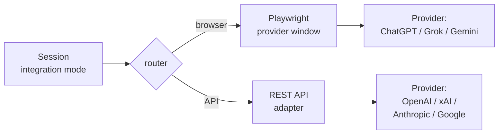

This page explains which AI providers Cortiq supports, the two integration modes you can use to reach them, and how that choice affects daily operation. By the end you'll know which provider and mode to configure for your first session.

## What this is

Cortiq talks to four provider families: **ChatGPT** (OpenAI), **Grok** (xAI), **Gemini** (Google), and **Claude** (Anthropic). Each session stores a provider and an integration mode, and Cortiq routes the request through the matching pipeline.

Two integration modes exist:

- **Browser mode** — Cortiq automates a logged-in provider web window using Playwright. The session reuses the subscription you already pay for.
- **API mode** — Cortiq talks to the provider's REST API through a structured adapter using your API key.

Browser mode trades cleaner billing (no per-token cost on top of your subscription) for tighter coupling to the provider's web UI. API mode gives you persisted conversations, fallback providers, and token tracking, but adds a per-call cost.

## How it fits into Cortiq

*Each session picks one of two integration modes per provider. Browser mode automates a logged-in window; API mode hits the provider's REST API directly.*

Provider setup lives in `Settings` → `AI Providers`. Per-session provider choice happens in the session create dialog under `Library` → `Sessions`.

## How to use it

### Configure API keys

Open `Settings` → `AI Providers` and paste an API key for each provider you intend to use in API mode. Keys are stored in encrypted local storage on Windows; they never leave the machine.

<!-- SCREENSHOT-NEEDED: ai-providers__api-keys.png – Cortiq Settings → AI Providers panel with API key fields filled (placeholders) for OpenAI, xAI, Anthropic, Google. Use placeholder keys (sk-...REDACTED) only -->

You can configure both modes for the same provider — the choice is made per session, not globally.

### Sign in for browser mode

For each provider you want to use in browser mode, open the provider's window from `Settings` → `AI Providers` and complete a normal web login. Cortiq remembers the session, and Playwright reuses the logged-in window when sessions run.

<!-- SCREENSHOT-NEEDED: ai-providers__browser-mode.png – Browser-mode flow: a Playwright-controlled provider window showing logged-in state. Mask any real account email -->

### Pick the mode per session

When you create or edit a session, you choose the provider and the mode together. Cortiq routes the session to the matching pipeline — one session can use Claude in API mode while another uses ChatGPT in browser mode.

### Set feature-level overrides (optional)

The `Settings` → `AI Providers` screen has a `Feature AI Providers` section. Use it to assign a different provider and mode to a specific Cortiq feature — for example, journaling — without changing the session default. That's useful when one provider is better for your trading loop but another is better for a supporting workflow.

## Reference

### Provider × mode matrix

| Provider | Browser mode | API mode | Notes |
| --- | --- | --- | --- |
| ChatGPT (OpenAI) | yes | yes (API uses OpenAI key) | Both modes well-supported. |
| Grok (xAI) | yes | yes (API uses xAI key) | Both modes well-supported. |
| Gemini (Google) | yes | yes (API uses Google key) | Both modes well-supported. |
| Claude (Anthropic) | check current build | yes (API uses Anthropic key) | API mode is the primary integration. |

### Picking a mode

| If you need | Prefer |
| --- | --- |
| Reuse an existing provider subscription instead of paying per token | Browser mode |
| Persisted, structured conversation history | API mode |
| Fallback provider when the primary fails mid-session | API mode |
| Token usage tracking | API mode |
| Lowest setup friction (no API key needed) | Browser mode |
| A different provider per Cortiq feature | `Settings` → `AI Providers` → `Feature AI Providers` |

### What provider choice affects beyond response text

- Session traceability (API mode persists structured turns; browser mode is web-window scoped).
- Operational cost structure (subscription vs per-call billing).
- Failure handling (only API mode has automatic fallback).
- Setup effort (browser mode needs a web login; API mode needs a key).

## Common questions

**Can I switch a session from browser to API mode after it's running?**
No. The mode is part of the session config. Stop the session, change the mode in the session edit dialog, and start a new run.

**What happens if my browser mode window logs out?**
The session pauses on the next cycle and surfaces the auth failure in the session detail. Re-login from `Settings` → `AI Providers` and resume.

**Why doesn't Cortiq just pick the cheapest mode?**
Because price isn't the only criterion. API mode adds traceability and fallback that some operators want at any cost; browser mode reuses an existing subscription that some operators already prefer. Cortiq presents both and lets you pick.

## What to read next

1. [Sessions & AutoScan](sessions-and-autoscan/) — where the provider choice is made per session.
2. [Workspace & monitoring](workspace-and-monitoring/) — `Provider Health` is where you watch reliability over time.
3. [MCP and agent integration](mcp-and-agent-integration/) — when an external agent drives the workflow instead of the internal loop.

## Related

- [Getting started](getting-started/)
- [First 30 minutes in Cortiq](first-30-minutes/)
- [Playbooks & data packages](playbooks-and-data/)
- [Glossary](glossary/)
