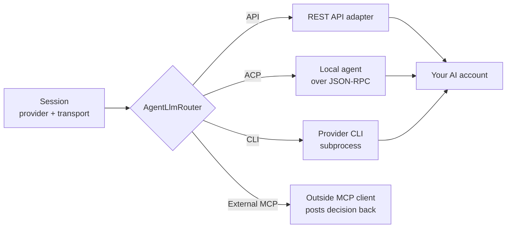

Cortiq is bring-your-own-AI: you supply the provider, Cortiq drives it. This page explains which providers Cortiq supports, the four transports that reach them, and how to choose a provider and transport for each part of your workflow. By the end you'll know what to configure for your first session and how to wire a different provider into a single feature.

## What this is

Cortiq never ships a hosted model. Every cycle, every artifact, and every Copilot reply runs through an AI account that you own. You choose the provider and Cortiq routes the request through whichever transport that provider is configured for.

There are five providers and four transports. A provider is the model family — who answers. A transport is the wire — how Cortiq reaches it. Most pairings of the two are valid, and the right pairing depends on whether you want metered API billing, a subscription you already pay for, or a model running entirely on your own hardware.

The router (`AgentLlmRouter`) resolves the transport per session at call time, so the rest of Cortiq — the trading cycle, the journal generator, the MCP tools — never needs to know which provider or transport is in use.

## Who this is for

- You have an API key, a local model endpoint, or a local agent you can authenticate, and you want Cortiq to use it.
- You want to reuse a Claude or ChatGPT subscription you already pay for instead of paying per token.
- You want one provider for the trading loop and a cheaper one for supporting work like the journal.

This page is not the right fit if you expected a model bundled with the app. Cortiq is BYO-AI only; there is no managed Cortiq model to turn on.

## Providers

| Provider | Who runs the model | API default model | Local agent transports |
| --- | --- | --- | --- |
| ChatGPT (OpenAI) | OpenAI | `gpt-4o` | ACP (`codex-acp`) |
| Gemini (Google) | Google | `gemini-2.0-flash` | CLI (`gemini`) |
| Claude (Anthropic) | Anthropic | `claude-sonnet-4-6` | ACP (`claude-agent-acp`), CLI (`claude`) |
| OpenRouter / OpenAI-compatible | OpenRouter or your endpoint | `openai/gpt-4o-mini` (override per endpoint) | — |
| Local model | Your machine | depends on your install | — (runs over the API transport) |

The configured model per provider is overridable in `Settings` → `AI Providers`. Leaving the model blank uses the provider default in the table.

:::note
The **Local model** provider targets a local OpenAI-compatible endpoint such as Ollama or LM Studio (default `http://localhost:11434/v1/chat/completions`). It reaches the model over the API transport, but the endpoint must resolve to your own loopback or private-network host — Cortiq rejects a Local-model endpoint that points at a public address.
:::

## Transports

A transport is how Cortiq reaches the provider. The same provider can be reachable several ways; you pick one per session (or let Cortiq auto-resolve it).

### API

Cortiq calls the provider's REST API directly with your API key. Keys are stored encrypted on the local machine and never leave it.

API is the default transport for new sessions. It is the only transport that persists structured conversation turns, supports an automatic fallback provider when the primary fails, and offers web-context tools (`web_search`, `web_fetch`) during artifact generation. The cost is metered per token.

Pick API when you want traceability, fallback, and the least setup — one key and you're running.

### ACP

ACP (Agent Client Protocol) drives a local agent command that you have installed and authenticated, talking to it over JSON-RPC on standard input/output. Cortiq launches the agent process and passes prompts to it; it never sees your subscription token.

ACP is supported for **ChatGPT** (via `codex-acp`) and **Claude** (via `claude-agent-acp`). It is the path that reuses a Claude or ChatGPT subscription you already pay for, so there is no per-token charge on top of the plan.

Pick ACP when you already pay for Claude Code or Codex and want Cortiq to run on that plan rather than a metered key.

### CLI

CLI mode runs the provider's command-line tool as a subprocess. It is supported for **Claude** (`claude`) and **Gemini** (`gemini`). Cortiq invokes the tool and reads its output; the tool manages its own authentication and conversation continuity.

For Claude subscription use, ACP is preferred over CLI because it uses a structured agent protocol. CLI remains available as a compatibility fallback.

Pick CLI when you have a provider's CLI installed and authenticated and ACP isn't available for it (Gemini), or as a fallback for Claude.

### External MCP

In External MCP mode Cortiq itself never calls a model. Its MCP server hands the prompt to an outside MCP-aware client — Claude Desktop, Claude Code, or another agent — and waits up to 15 minutes for that client to post a decision back through the `wait_for_cycle_prompt` and `submit_cycle_decision` tools.

Pick External MCP when an external agent, not Cortiq's internal loop, is the thing driving the trade.

:::caution
External MCP sessions hand control to an outside agent. The external client is the only thing producing decisions — if it never posts back, the cycle waits out its timeout and does nothing.
:::

### Choosing a transport

| If you want | Prefer |
| --- | --- |
| Least setup, persisted history, automatic fallback | API |
| Reuse a Claude or ChatGPT subscription you already pay for | ACP |
| A provider CLI you've already installed (Gemini, or Claude fallback) | CLI |
| An external agent to drive the trade, not Cortiq's loop | External MCP |
| A model running entirely on your own hardware | Local model (over API transport) |

## How it fits into Cortiq

```mermaid
flowchart LR
  S[Session<br/>provider + transport] --> R{AgentLlmRouter}
  R -->|API| AP[REST API adapter]
  R -->|ACP| AC[Local agent<br/>over JSON-RPC]
  R -->|CLI| CL[Provider CLI<br/>subprocess]
  R -->|External MCP| EX[Outside MCP client<br/>posts decision back]
  AP --> P[Your AI account]
  AC --> P
  CL --> P
```

*Each session stores a provider and a transport. The router picks the transport at call time and reaches your own AI account through it.*

Provider and transport setup lives in `Settings` → `AI Providers`. The per-session provider and transport are set in the session create dialog under `Library` → `Sessions`.

## How to use it

### Configure a provider

Open `Settings` → `AI Providers`. Each provider has its own card. Select the transport you want for that provider (the chips list only the transports that provider supports), then fill the matching fields:

- **API** — paste the API key. Optionally pick a non-default model.
- **ACP** — click **Configure**. Cortiq installs the known agent packages for that provider and opens its login command so you sign in directly. For Claude that is `@anthropic-ai/claude-code` plus `@agentclientprotocol/claude-agent-acp`; for ChatGPT it is `@openai/codex` plus `@zed-industries/codex-acp`.
- **CLI** — point Cortiq at the installed CLI (or leave the default on `PATH`) and authenticate the tool with its own login.

### Read the auth badge

Every provider card carries a `ProviderAuthBadge` showing whether the selected transport is authenticated. The same badge appears on the Copilot dock and the `Provider Health` page.

The badge matters because a session **will not start an unauthenticated provider**. When you start a run, Cortiq runs an auth preflight; if the provider isn't authenticated, the start fails with an operator-readable message (for example, "Run `claude` to log in") instead of failing mid-cycle. Use **Check now** on the card to re-probe after you sign in.

### Pick the provider and transport per session

When you create or edit a session you choose its provider and transport together. One session can run Claude over ACP while another runs ChatGPT over the API. You can also set a fallback provider on the session: the API transport switches to it after the primary exhausts its retries, and retries the primary every five minutes.

### Set per-feature provider overrides (optional)

The `Settings` → `AI Providers` screen maps each AI-driven feature to a provider and transport, so you can run the trading loop on one provider and supporting work on another. The features you can override are:

- **Journal** — generates the post-session journal entry.
- **Preparation** — builds preparation packages.
- **Sentiment** — generates sentiment reports.
- **Instrument Profile** — builds instrument profiles.
- **Trading Cycle** — the session default for live decision cycles.
- **Backtesting** — the provider used when a backtest replays cycles.
- **Copilot** — the in-app assistant (Ctrl+K).

Changing a feature's provider inherits that provider's selected transport by default, so the two never silently disagree; an explicit per-feature transport override is still available. The **Use one AI for every feature** panel applies a single provider and transport to every feature at once.

:::tip
Run the trading cycle on your strongest provider and point Journal, Preparation, and Sentiment at a cheaper or local model. The supporting features don't need the decision-quality of the live loop, and the saving compounds across a trading week.
:::

## Reference

### Provider × transport support

| Provider | API | ACP | CLI | External MCP |
| --- | --- | --- | --- | --- |
| ChatGPT (OpenAI) | yes | yes (`codex-acp`) | — | yes |
| Gemini (Google) | yes | — | yes (`gemini`) | yes |
| Claude (Anthropic) | yes | yes (`claude-agent-acp`) | yes (`claude`) | yes |
| OpenRouter / compatible | yes | — | — | yes |
| Local model | yes | — | — | yes |

External MCP is a session-level mode rather than a per-provider capability: in that mode Cortiq doesn't call any provider itself, so it applies regardless of which provider account the external client uses.

### What provider and transport choice affects

- **Cost.** API is metered per token; ACP and CLI reuse a subscription you already pay for; Local model runs on your own hardware.
- **History.** The API transport persists structured conversation turns; ACP, CLI, and External MCP delegate continuity to the agent or client.
- **Fallback.** Only the API transport has automatic fallback to a second provider.
- **Setup.** API needs one key; ACP and CLI need an installed, authenticated local tool; External MCP needs an outside client wired to the Cortiq MCP server.

## Common questions

**Is there a managed Cortiq model I can turn on?**
No. Cortiq is bring-your-own-AI. You configure your own provider account; Cortiq supplies the workflow around it.

**Can I switch a session's provider or transport while it's running?**
No. They are part of the session config. Stop the session, change them in the session edit dialog, and start a new run.

**A session won't start and says the provider isn't authenticated. Why?**
The auth preflight blocks any run whose provider isn't signed in. Open the provider's card in `Settings` → `AI Providers`, complete the login (API key, or the CLI/ACP login command), use **Check now**, and start the run again.

**Why pick ACP over the API for Claude?**
ACP runs on a Claude subscription you already pay for, with no per-token charge. The API transport bills per token but adds persisted history and automatic fallback. Choose on cost versus traceability.

## What to read next

1. [Sessions](sessions/) — where the provider and transport are chosen per session.
2. [Workspace & monitoring](workspace-and-monitoring/) — `Provider Health` is where you watch auth and reliability over time.
3. [MCP and agent integration](mcp-and-agent-integration/) — when an external agent drives the workflow instead of the internal loop.

## Related

- [Getting started](getting-started/)
- [First 30 minutes in Cortiq](first-30-minutes/)
- [Playbooks & data packages](playbooks-and-data/)
- [Glossary](glossary/)
