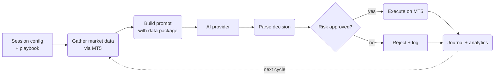

Cortiq is a Windows desktop trading platform that pairs MetaTrader 5 execution with AI decision-making and platform-level risk controls. These docs take you from evaluation through installation to daily operation.

:::danger
Trading risk exists in all markets. Cortiq is a trading tool, not a profit guarantee. Use conservative risk limits, test in virtual mode first, and review your own regulatory obligations before deploying live capital.
:::

## What this is

Cortiq runs one repeatable operating loop on your Windows machine. It gathers market context from MetaTrader 5, asks an AI provider for a decision under a structured playbook, validates that decision against your risk limits, executes on MT5, and journals every cycle for later review.

You stay in control of the strategy. Playbooks define the rules the AI must follow. Data packages define the context it sees. Risk limits define what trades it can take. Cortiq orchestrates the loop and keeps the boundaries you set hard.

These docs cover the full surface: what Cortiq is, how to install it, the screens you work in day-to-day, and how to design playbooks, run sessions, and audit results.

## How it fits into Cortiq

Every Cortiq feature is a component of one operating loop. Each session is locked to a single instrument so the AI builds deep, measurable expertise on that one market. The same loop runs against any of the supported AI providers, and across one MT5 account or several.

```mermaid
flowchart LR
  A[Session config<br/>+ playbook] --> B(Gather market data<br/>via MT5)
  B --> C(Build prompt<br/>with data package)
  C --> D[AI provider]
  D --> E(Parse decision)
  E --> F{Risk approved?}
  F -->|yes| G(Execute on MT5)
  F -->|no| H[Reject + log]
  G --> I(Journal + analytics)
  H --> I
  I -.next cycle.-> B
```

*Cortiq's per-cycle loop: configured input becomes a structured prompt, the AI returns a decision, risk filters approve or reject, and journals capture every cycle.*

## Reference

| Area | What Cortiq does |
| --- | --- |
| Decision support | Sends structured market context to AI providers and receives trading decisions back in a controlled format. |
| Trade execution | Connects to a local MetaTrader 5 terminal to place, modify, and close trades. |
| Strategy control | Encodes your logic in playbooks and data packages so the AI executes inside the framework you define. |
| Risk control | Applies global and per-account risk limits before and during every trade. |
| Validation | Replays a session or playbook against historical M1 data so you can test before risking capital — no license required. |
| Operations | Tracks sessions, journals, notifications, system messages, and account activity in one desktop workspace. |
| Learning | Runs one-click AI session reviews that score the run and store durable per-instrument lessons. |

:::note
This site shares its repository with Cortiq's GitHub Releases, Issues, and Discussions — keeping docs, the Windows installer, bug reports, and usage questions in one public place.
:::

## What to read next

1. [Getting started](/cortiq-public/getting-started/) — orientation if you're evaluating Cortiq, including who it's for and what the first day looks like.
2. [App navigation guide](/cortiq-public/app-navigation-guide/) — maps every doc to the matching sidebar entry and screen in the desktop app.
3. [Feature overview](/cortiq-public/feature-overview/) and [Capability reference](/cortiq-public/capability-reference/) — the at-a-glance and function-by-function maps of everything Cortiq does.
4. [Installation & activation](/cortiq-public/installation-and-activation/) — the Windows install and license activation flow.
5. [First 30 minutes in Cortiq](/cortiq-public/first-30-minutes/) — guided walkthrough from install to your first safe virtual session.
6. [MetaTrader 5 integration](/cortiq-public/mt5-integration/) and [AI providers](/cortiq-public/ai-providers/) — read these before your first live setup.
7. [Playbooks & data packages](/cortiq-public/playbooks-and-data/), [Sessions](/cortiq-public/sessions/), and [Risk management](/cortiq-public/risk-management/) — the building blocks of your operating model.
8. [Backtesting](/cortiq-public/backtesting/) — replay a session against history first; it's the only path that runs without a license.
9. [Workspace & monitoring](/cortiq-public/workspace-and-monitoring/) and [Session reviews](/cortiq-public/session-review/) — the day-to-day screens, plus the AI review loop that turns runs into durable lessons.

## Related

- [Documentation map](/cortiq-public/documentation-map/)
- [Feature overview](/cortiq-public/feature-overview/)
- [Glossary](/cortiq-public/glossary/)
- [Licensing & support](/cortiq-public/licensing-and-support/)
- [FAQ](/cortiq-public/faq/)
