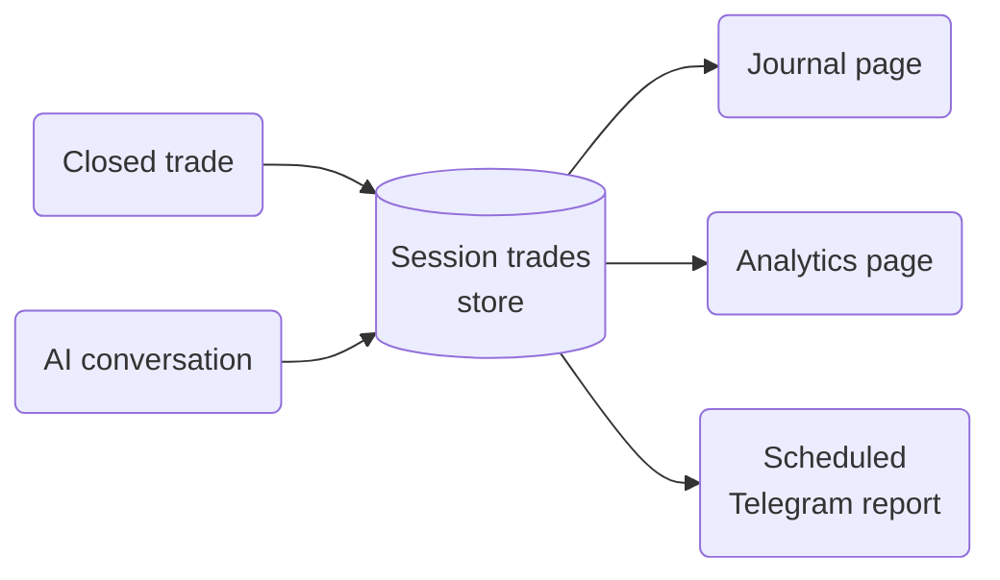

This page covers the review surface of Cortiq: trade journals, session journals, analytics, cohort comparison, and the raw conversations view. By the end you'll know which screen answers which review question and the loop that ties them together.

## What this is

Cortiq is not only about opening trades — it's also about understanding what happened and whether the workflow is improving. The review surface is built around that understanding.

Three journal types capture different scopes:

- **Trade journal** — one trade, with entry, management, exit, and the AI's reasoning attached.
- **Session journal** — one session over a broader window, with cycle-by-cycle behavior.
- **Run journal** — one start-to-stop run, useful for comparing executions of the same configuration.

Analytics computes the metrics on top of those journals; cohorts let you compare sessions side-by-side; conversations gives you the raw AI dialogue when the rendered journal isn't enough.

## How it fits into Cortiq

*Every closed trade and every AI cycle lands in one store. The Journal, Analytics, and scheduled-report views are different lenses on the same data.*

The review surface lives across four screens:

- `Library` → `Journal` — trade journal and session journal.
- `Library` → `Dashboard` — performance and risk overview.
- `Library` → `Session Cohorts` — side-by-side session comparison.
- `Library` → `Conversations` — raw AI conversations across sessions.

## How to use it

### Establish a review rhythm

Don't open the journal only when something goes wrong. The loop that produces compounding improvement looks like this:

1. Make one strategy change (playbook section, data package input, or risk limit).
2. Run the updated logic in a controlled scope — one symbol, one session.
3. Review the session journal end-to-end, not only the trade list.
4. Check whether the metric you intended to move actually moved.
5. Adjust before changing anything else.

Changing two things at once turns the review into guesswork.

### Read the right journal for the question

| Question | Journal to read |
| --- | --- |
| Did this single trade follow the playbook? | Trade journal. |
| Did this session stay disciplined over the day? | Session journal. |
| Did the AI's reasoning change after I edited the playbook? | Conversations view + session journal. |
| How does this run compare to last week's? | Run journal + analytics. |
| Which configuration is winning across multiple sessions? | Session cohorts. |

### Compare configurations with cohorts

Open `Library` → `Session Cohorts` and group sessions you want to compare. Cohorts work best when the sessions actually match on most variables — same symbol, same provider, same risk profile — and differ only on the lever you're testing. Comparing two sessions that differ on five variables tells you nothing.

<!-- SCREENSHOT-NEEDED: journal-and-analytics__analytics.png – Analytics page with P/L chart, win rate, best/worst day stats visible. Mask account -->

### Schedule a recurring summary

Set up a daily or weekly Telegram report under `Settings` → `Reports`. The summary is the same data the workspace shows, but lands in your phone without you opening the desktop. See [Execution modes & notifications](execution-modes-and-notifications/) for the configuration steps.

## Reference

### Metrics computed by the analytics layer

| Metric | What it tells you |
| --- | --- |
| Daily P/L | Today's net profit or loss across the configured scope. |
| Weekly P/L | The current week's net result. |
| Total P/L | Cumulative across all included sessions. |
| Win rate | Percentage of trades that closed in profit. |
| Best and worst day | The single days with the highest gain and loss. |
| Best and worst trade | Outlier trades on either side. |
| Average win / average loss | The expected size of each side; the ratio matters more than either number alone. |
| Total trade count | Activity volume; useful for spotting overtrading. |

### Journal scopes

| Scope | Records | Useful for |
| --- | --- | --- |
| Trade | One trade's entry, management, exit, and AI reasoning. | Single-decision review. |
| Session | Every cycle in a session window. | Strategy-level review. |
| Run | One start-to-stop execution. | Comparing executions of the same configuration. |

## Common questions

**My win rate dropped after a playbook change — should I roll back?**
Not yet. Open the session journal and check whether losing trades are losing for the same reason. A higher loss rate on disciplined trades means the playbook now passes on setups the old version took — that may be the desired change. A higher loss rate on improvised trades means the playbook lost structure.

**Cohort comparison shows two sessions are very different — what's it actually telling me?**
Cohorts surface differences; they don't explain them. Use cohorts to find the gap, then open the session journals on both sides to read the cycles where the divergence appeared.

**How long is journal data kept?**
For the lifetime of the local Cortiq install. Journals live in the local SQLite database; they don't expire. Back up `cortiq.db` with the rest of your machine if you want offsite history.

## What to read next

1. [Workspace & monitoring](workspace-and-monitoring/) — the screens that surface the journal data.
2. [Execution modes & notifications](execution-modes-and-notifications/) — scheduled reports configuration.
3. [Playbook design guide](trading-cycle/playbook-design/) — the iteration that the journal-driven loop should produce.

## Related

- [Sessions & AutoScan](sessions-and-autoscan/)
- [Risk management](risk-management/)
- [Capability reference](capability-reference/)
- [Glossary](glossary/)
