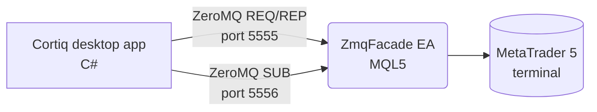

Cortiq's only execution path is MetaTrader 5 on the same Windows machine. This page explains how that connection works, what to configure before you trade live, and how to scale it across multiple accounts without a port collision.

:::caution
Cortiq talks to MT5 through a small Expert Advisor called `ZmqFacade`. If `ZmqFacade` is not attached to a chart and running, no Cortiq feature that touches MT5 will work — pricing, orders, account state, and risk checks all fail closed.
:::

## What this is

Cortiq runs as a local Windows desktop app and reaches MetaTrader 5 over a ZeroMQ bridge on `localhost`. It's a tightly coupled pair: Cortiq sends commands and receives streaming data through `ZmqFacade`, an Expert Advisor that lives inside your MT5 terminal.

This is not a generic broker connector. Cortiq does not support MT4, web brokers, or proprietary APIs. If your broker offers MT5, you can run Cortiq against it; if it doesn't, Cortiq isn't the right tool.

The integration handles every market interaction the platform needs: live pricing, account state, order placement and modification, position management, and connection health.

## How it fits into Cortiq

*Cortiq talks to each MT5 terminal through a small Expert Advisor (`ZmqFacade`) over two ZeroMQ ports — one for synchronous commands, one for streaming data.*

| Area | Cortiq's role |
| --- | --- |
| Market data | Reads candles, ticks, and indicator values from the connected terminal. |
| Account context | Reads balance, equity, margin level, and symbol properties on every cycle. |
| Order flow | Places market and pending orders when a session is allowed to execute. |
| Position management | Modifies stop-loss / take-profit, performs partial and full closes, runs trailing logic. |
| Monitoring | Tracks bridge health and pauses sessions cleanly on disconnect or risk events. |

## How to use it

The setup has three parts: install the EA in your terminal, configure the account in Cortiq, and verify the bridge is healthy before starting a session.

### 1. Configure the MT5 account in Cortiq

Open `Settings` → `MT5 Accounts` and add an entry. You'll need the terminal's executable path, the data folder, and a unique pair of ZeroMQ ports.

<!-- SCREENSHOT-NEEDED: mt5-integration__settings-page.png – Cortiq Settings → MT5 Accounts panel with one configured account, default badge visible. Mask account number (first 3 + last 2 ok), use a demo broker name -->

### 2. Attach `ZmqFacade` to a chart in MT5

Open MetaTrader 5 and drop `ZmqFacade.ex5` onto any chart. Allow algorithmic trading and DLL imports when prompted. The EA's smiley face icon appears in the top-right of the chart when it's running.

<!-- SCREENSHOT-NEEDED: mt5-integration__zmqfacade-attached.png – A blank EURUSD chart in MT5 with ZmqFacade EA attached and the smiley face icon visible (top-right of chart). Mask broker name and balance -->

### 3. Verify the bridge is healthy

Cortiq's topbar shows an MT5 health indicator. Green means the bridge is connected and recent heartbeats arrived on time; red means the EA isn't responding. Don't start a session until the indicator is green.

<!-- SCREENSHOT-NEEDED: mt5-integration__health-green.png – Cortiq topbar showing the MT5 health indicator in green/connected state -->

### Multi-account setup

Cortiq supports multiple MT5 accounts on the same machine, but each terminal must run on a non-overlapping pair of ZeroMQ ports.

Example pattern:

- Account 1 — command port `5555`, data port `5556`.
- Account 2 — command port `5557`, data port `5558`.
- Account 3 — command port `5559`, data port `5560`.

The exact numbers don't matter — non-overlap does. Two terminals on the same port will collide silently and one of them will appear to "work intermittently".

## Reference

| Setting | Where | Notes |
| --- | --- | --- |
| Terminal path | `Settings` → `MT5 Accounts` → *Terminal executable* | Full path to `terminal64.exe`. |
| Data folder | `Settings` → `MT5 Accounts` → *Data folder* | Where Cortiq writes the EA companion files. |
| Command port | `Settings` → `MT5 Accounts` → *ZMQ command port* | REQ/REP. Default `5555`. Must be unique across accounts. |
| Data port | `Settings` → `MT5 Accounts` → *ZMQ data port* | PUB/SUB. Default `5556`. Must be unique across accounts. |
| Default account | `Settings` → `MT5 Accounts` → *Default* | The account that new sessions and trade ideas pre-select. |

## Common questions

**Is MT4 supported?**
No. Only MT5. Brokers that offer both will work as long as you connect through their MT5 build.

**Can I run a remote MT5 terminal?**
No. Cortiq and MT5 must be on the same Windows machine. The bridge uses `localhost` ZeroMQ and assumes both processes share the same OS.

**What happens if MT5 disconnects mid-session?**
The session pauses on the next health-check failure. No new orders are placed; open positions remain managed by MT5 itself until the bridge recovers and Cortiq re-attaches.

## What to read next

1. [First 30 minutes in Cortiq](first-30-minutes/) — installs the EA and runs a virtual session end-to-end.
2. [Sessions & AutoScan](sessions-and-autoscan/) — once the bridge is green, this is where you build the session that uses it.
3. [Risk management](risk-management/) — configure global and per-account limits before any live execution.

## Related

- [Installation & activation](installation-and-activation/)
- [AI providers](ai-providers/)
- [Workspace & monitoring](workspace-and-monitoring/)
- [Glossary](glossary/)
