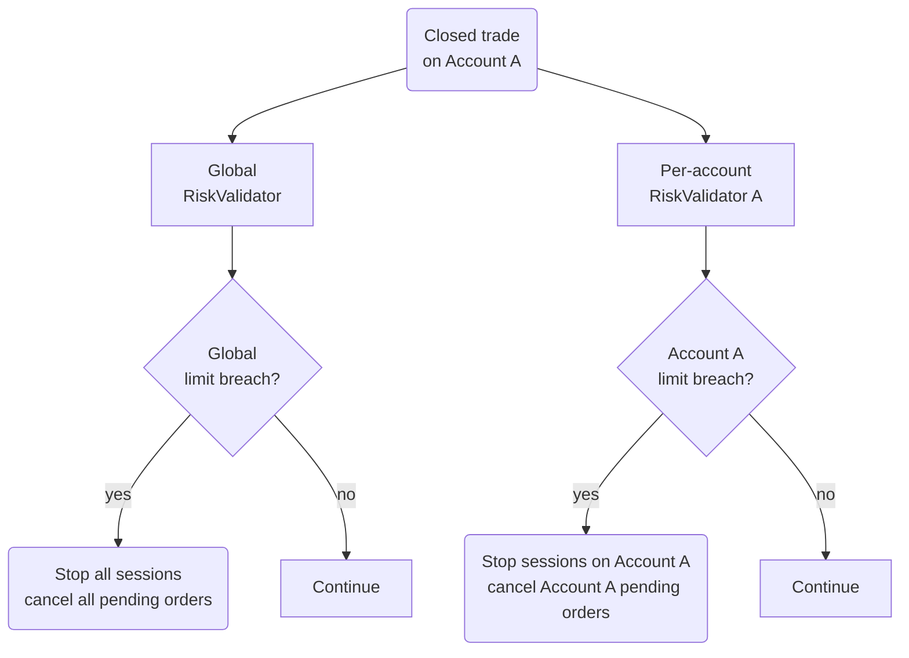

This page explains Cortiq's risk system: a dual-layer control plane that sits above the AI decision and the MT5 execution. By the end you'll know what each limit does, what happens at a breach, and how to configure rules that genuinely protect the workflow.

:::danger
Live trading without configured risk limits sends real orders with no platform-level circuit breaker. Configure global and per-account limits before a session ever runs in non-virtual mode. The AI's judgment is not a substitute for risk validators.
:::

## What this is

Cortiq does not assume a good AI response is enough. Every trading system needs an independent control layer above execution, and that layer is built into the product.

The risk system is **dual-layer**. Global limits apply across every connected MT5 account; per-account limits apply to one account in isolation. Both layers run on every closed trade, so a single trade can simultaneously be allowed under your global rules but breach a per-account rule, or vice versa.

The two layers exist because most operators have at least two simultaneous mandates: a *whole environment* mandate (don't let total daily drawdown exceed X) and a *per-account* mandate (don't let prop-firm Account A exceed its specific challenge limits). Mixing the two into one rule set produces rules that are wrong for both.

## How it fits into Cortiq

*Each closed trade is recorded in both validators. The two breach paths are independent: a global breach stops every account; a per-account breach stops only that account.*

Risk is visible in two screens:

- `Tools` → `Risk Management` — configure global and per-account limits.
- `Library` → `Dashboard` — monitor real-time risk usage across the environment.

## How to use it

### Configure global limits first

Open `Tools` → `Risk Management` and select the `Global` tab. Set conservative defaults before any live execution.

<!-- SCREENSHOT-NEEDED: risk-management__global-panel.png – Risk Management page with the Global tab selected, all six limits visible -->

Conservative is not optional. Tighten until you'd be comfortable with the worst-case loss the rule allows; you can always loosen later, but you can't undo a breach that exceeded a too-wide limit.

### Configure per-account limits

Switch to the `Per-Account` tab and configure rules for each MT5 account independently. Use this to encode account-specific mandates: prop-firm challenge limits, a personal account's daily drawdown, a copy-trading follower's max exposure.

<!-- SCREENSHOT-NEEDED: risk-management__account-panel.png – Risk Management page with the Per-Account tab selected, one account's limits visible. Mask account number -->

### Configure your day-start time

Risk validators reset their daily counters at a configured local time, not at OS midnight. Set the day-start time to match your trading day (often 22:00 UTC for FX). The wrong day-start time silently makes "daily drawdown" mean something else than you expect.

### Watch for `RiskPaused` sessions

When a validator triggers, the affected sessions transition to `RiskPaused`. Don't manually unpause — the platform resumes them automatically when the breach condition clears (for example, the next trading day starts). Stop the session manually if you genuinely want to override.

## Reference

### Limits the platform enforces

| Limit | Layer | Triggers when |
| --- | --- | --- |
| Maximum daily drawdown | Global, per-account | Total realized + unrealized loss exceeds the configured percentage. |
| Maximum weekly drawdown | Global, per-account | Loss across the rolling week exceeds the configured percentage. |
| Daily profit target | Global, per-account | Cumulative daily P/L meets the configured target. |
| Weekly profit target | Global, per-account | Cumulative weekly P/L meets the configured target. |
| Maximum daily trade count | Global, per-account | Closed-trade count for the day reaches the limit. |
| Maximum total open trades | Global, per-account | Concurrent open positions reach the limit. |
| Maximum trades per symbol | Per-account | Concurrent positions on one symbol reach the limit. |
| Maximum symbol exposure | Per-account | Combined exposure on one symbol exceeds a percentage of equity. |
| Default risk per trade | Per-account | New orders sized above the default risk percentage are blocked. |
| Stop-on-loss-streak | Per-account | Consecutive losing trades reach the configured count. |
| Include manual trades | Both | Toggle: count manual MT5 trades against the same validators. |

### What happens on a breach

| Layer | Effect |
| --- | --- |
| Global | Stops every session, cancels all pending orders. |
| Per-account | Stops sessions on the affected account, cancels that account's pending orders. Other accounts continue. |

In both cases the affected sessions move to `RiskPaused` and the breach is logged with the trigger condition.

## Common questions

**My session is `RiskPaused` — should I just resume it?**
No. The pause exists because a limit was hit. Either let the validator auto-resume (when the daily counter resets, for example), or stop the session and review the journal before changing the limit.

**Risk limits applied but I see a loss bigger than the daily drawdown — why?**
Validators run on closed trades. An open position can drift past the daily drawdown intra-trade; the validator triggers when the loss is realized or when the unrealized loss is checked at cycle end. To enforce a hard intra-bar stop, set protective SLs on the positions themselves.

**Do risk limits apply to External MCP sessions?**
Yes. Both autonomous and external sessions go through the same validator pipeline before any order reaches MT5.

## What to read next

1. [Sessions & AutoScan](sessions-and-autoscan/) — `RiskPaused` and the rest of the session lifecycle.
2. [Execution modes & notifications](execution-modes-and-notifications/) — virtual mode rehearses risk behavior without using capital.
3. [Journal & analytics](journal-and-analytics/) — review breaches before adjusting limits.

## Related

- [MetaTrader 5 integration](mt5-integration/)
- [Workspace & monitoring](workspace-and-monitoring/)
- [Capability reference](capability-reference/)
- [Glossary](glossary/)
