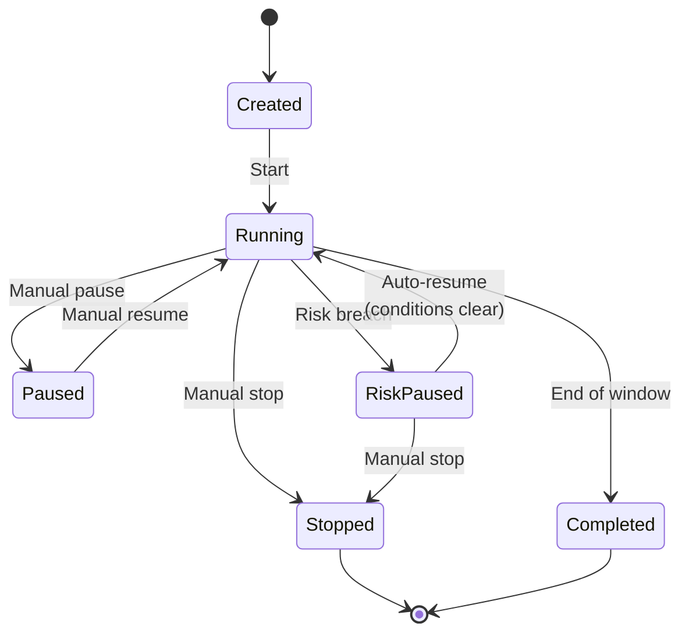

This page explains the Cortiq session — the operating container that turns a configuration into something you can run, pause, review, and improve. By the end you'll know which states a session moves through, when to use AutoScan, and which session type fits your workflow.

## What this is

A session bundles everything Cortiq needs to trade: an MT5 account, an AI provider and integration mode, one or more playbooks, a data package, a symbol selection method, a time window, and the risk and execution settings.

In practical terms, the session is the unit you operate. You start it, watch it cycle, pause or stop it, review the journal, and decide what to change. The same operating loop runs whether you're trading one symbol or twenty.

Cortiq supports two session types — autonomous (the default) and external MCP (advanced). Most users only need autonomous.

## How it fits into Cortiq

| Session type | Who controls the trading loop | When to use |
| --- | --- | --- |
| Autonomous | Cortiq's internal workflow engine | Default for most users; built-in automated operating loop. |
| External MCP | An external MCP-compatible AI client | Advanced; the agent drives data gathering, decisions, and execution. |

External MCP sessions skip the internal workflow engine — see [MCP and agent integration](mcp-and-agent-integration/).

*A session moves between five states. Only `RiskPaused` resumes automatically when the breach condition clears; manual `Paused` requires user action.*

## How to use it

### Create a session

Open `Library` → `Sessions` and create a new session. The dialog asks for an account, symbols, provider, time range, and risk settings.

<!-- SCREENSHOT-NEEDED: sessions-and-autoscan__create-form.png – Cortiq's session create dialog with Account, Symbol, Provider, Time Range, Risk fields visible. Mask account number -->

Defaults that work well for a first run: fixed symbol, virtual mode, conservative risk limits. You can change any of them after the first cycle has run.

### Choose between fixed-symbol mode and AutoScan

Two symbol-selection modes:

- **Fixed-symbol** — the session always trades the same instrument. Use this when you want clean specialization around one market.
- **AutoScan** — the AI reviews a candidate list each cycle and picks the strongest current opportunity. Use this when you trade a watchlist and want the system to choose where conditions are best.

AutoScan re-evaluates between cycles or after a trade closes, so a single session can drift through several symbols across a day. Fixed-symbol mode is the right starting point; switch to AutoScan when the playbook is stable enough to apply across instruments.

### Run, pause, and review

From the Sessions list you can start, pause, resume, and stop sessions. The session detail page shows the current cycle's progress, the AI conversation, and the decision history.

When a risk validator triggers a breach, the session transitions to `RiskPaused`. It auto-resumes once the breach condition clears (for example, the next day starts and the daily P/L counter resets).

When you reach the end of a configured time window, the session transitions to `Completed`.

## Reference

### What a session configures

| Area | Examples |
| --- | --- |
| Market scope | Fixed symbol, wildcard list, or AutoScan candidate set. |
| Time control | Trading hours, active weekdays, close-before-end rules. |
| Provider control | Provider choice, browser or API mode, fallback provider. |
| Strategy control | Playbook set, playbook priority, session instructions. |
| Execution control | Live or virtual mode, copy-trading targets, parallel-trade limits. |

### Per-cycle loop

Each cycle follows the same pattern:

`Data gather → Prompt build → AI call → Response parse → Decision → Risk validate → Execute → Log`

The same shape runs in every state except `Paused`, `RiskPaused`, `Stopped`, and `Completed`. For the full architectural breakdown, read [Trading cycle: overview](trading-cycle/overview/).

### State distinctions worth memorizing

| State | Resumes automatically? | Notes |
| --- | --- | --- |
| `Created` | n/a — start manually | Initial state after creation. |
| `Running` | n/a | Normal operating state. |
| `Paused` | No — manual resume | Operator-initiated pause. |
| `RiskPaused` | Yes — when breach clears | Triggered by a risk validator. |
| `Stopped` | No | Terminal for the run. |
| `Completed` | No | Terminal at end of time window. |

## Common questions

**My session is `RiskPaused` — how do I unpause it?**
Don't, usually. RiskPaused exists so the platform protects the workflow when a risk limit is hit. The session resumes automatically when the breach condition clears. If you want to override that, stop the session manually instead.

**Can I run two autonomous sessions on the same MT5 account?**
Yes, but coordinate symbols and risk so they don't compete. Risk validators apply per account regardless of how many sessions are open.

**How is AutoScan different from creating multiple fixed-symbol sessions?**
AutoScan picks one symbol per cycle dynamically. Multiple fixed-symbol sessions trade in parallel. AutoScan reduces over-trading; parallel sessions cover more markets simultaneously.

## What to read next

1. [Playbooks & data packages](playbooks-and-data/) — what the session executes.
2. [Risk management](risk-management/) — what triggers `RiskPaused` and how to configure it.
3. [Execution modes & notifications](execution-modes-and-notifications/) — virtual vs live, copy-trading, alerts.
4. [Trading cycle: session architecture](trading-cycle/session-architecture/) — the architecture behind the session loop.

## Related

- [Sessions](trading-cycle/entities/sessions/)
- [MCP and agent integration](mcp-and-agent-integration/)
- [Workspace & monitoring](workspace-and-monitoring/)
- [Capability reference](capability-reference/)
- [Glossary](glossary/)
