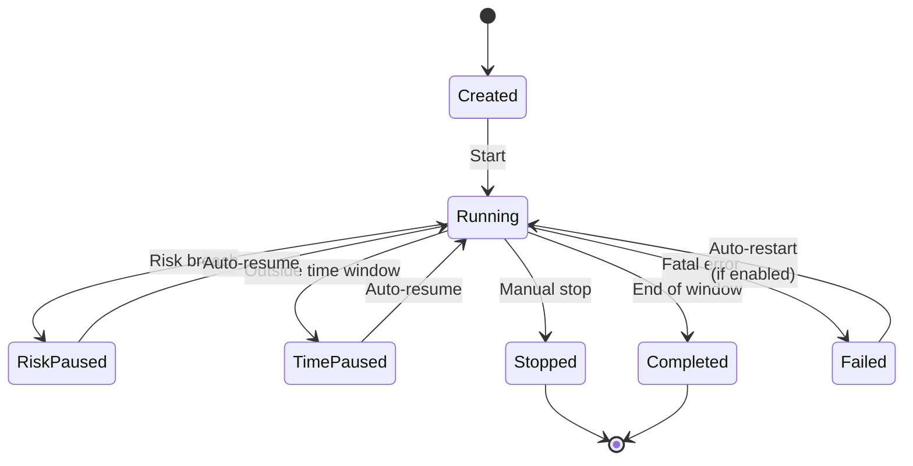

This page explains the Cortiq session — the operating container that turns a configuration into something you can run, pause, review, and improve. By the end you'll know which states a session moves through and how a session is scoped to a single instrument.

## What this is

A session bundles everything Cortiq needs to trade: an MT5 account, an AI provider and transport, one or more playbooks, a data package, a symbol, a time window, and the risk and execution settings.

In practical terms, the session is the unit you operate. You start it, watch it cycle, pause or stop it, review the journal, and decide what to change. Every session is locked to exactly one instrument, so the AI builds deep, measurable expertise on that market rather than spreading attention across many.

Cortiq supports two session types — autonomous (the default) and external MCP (advanced). Most users only need autonomous.

## How it fits into Cortiq

| Session type | Who controls the trading loop | When to use |
| --- | --- | --- |
| Autonomous | Cortiq's internal cycle engine | Default for most users; built-in automated operating loop. |
| External MCP | An external MCP-compatible AI client | Advanced; the agent drives data gathering, decisions, and execution. |

External MCP sessions skip the internal cycle engine — see [MCP and agent integration](mcp-and-agent-integration/).

*A session moves through `Created`, `Running`, two auto-resuming pause states (`RiskPaused`, `TimePaused`), and the terminal states `Stopped`, `Completed`, and `Failed`. A manual-only `Paused` state also exists but no automatic process writes it.*

## How to use it

### Create a session

Open `Library` → `Sessions` and create a new session. The form asks for an account, a symbol, a provider, a time range, and risk settings.

Defaults that work well for a first run: virtual mode and conservative risk limits. You can change any of them after the first cycle has run.

A session won't start on a provider that isn't authenticated. Cortiq runs an auth preflight check before the first cycle and blocks the start if the configured provider has no valid credentials.

### Pick the instrument

Each session is locked to one symbol. Choose the instrument the session will specialize in, and pair it with a playbook and data package built for that market. Keeping the session on a single symbol is what lets the AI accumulate readable, comparable results — the journal tells you whether the strategy is improving on that exact market.

If you want to trade a different instrument, create a separate session for it. Two sessions on two symbols run independently, each with its own playbook, data package, and risk picture.

### Run, pause, and review

From the Sessions list you can start, stop, and resume sessions. The list shows every session with its current state, so you can see at a glance which sessions are running, paused, or finished.

The session detail page shows the current cycle's progress, the live AI conversation, and the decision history.

When a risk validator triggers a breach, the session transitions to `RiskPaused`. It auto-resumes once the breach condition clears — for example, the next trading day starts and the daily P/L counter resets.

When the clock moves outside the session's configured time window, the session transitions to `TimePaused`. It auto-resumes when the schedule re-opens.

When you reach the end of a configured time window, the session transitions to `Completed`. A fatal error during a cycle moves the session to `Failed`; if you enabled auto-restart, Cortiq schedules a restart with exponential backoff and shows the remaining time on the detail page.

## Reference

### What a session configures

| Area | Examples |
| --- | --- |
| Market scope | One fixed symbol for the life of the session. |
| Time control | Trading hours, active weekdays, close-before-end rules. |
| Provider control | Provider choice, transport (API / ACP / CLI / External MCP), fallback provider. |
| Strategy control | Playbook set, playbook priority, session instructions. |
| Execution control | Live or virtual mode, trade-approval policy, parallel-trade limits. |

### Per-cycle loop

Each cycle follows the same pattern:

`Data gather → Prompt build → AI call → Response parse → Decision → Risk validate → Execute → Log`

The loop runs only while the session is `Running`. It is suspended in every pause or terminal state. For the full architectural breakdown, read [Trading cycle: overview](trading-cycle/overview/).

### State distinctions worth memorizing

| State | Resumes automatically? | Notes |
| --- | --- | --- |
| `Created` | n/a — start manually | Initial state after creation. |
| `Running` | n/a | Normal operating state. |
| `RiskPaused` | Yes — when breach clears | Triggered by a risk validator. |
| `TimePaused` | Yes — when the window re-opens | Set when the clock leaves the configured time range. |
| `Paused` | No — manual resume | Manual-only. No automatic process writes this state. |
| `Stopped` | No | Terminal for the run. Manual stop or app shutdown. |
| `Completed` | No | Terminal at end of time window. |
| `Failed` | Only if auto-restart is enabled | Terminal error. Restarts on a backoff schedule when you enabled auto-restart. |

## Common questions

**My session is `RiskPaused` — how do I unpause it?**
Don't, usually. RiskPaused exists so the platform protects the workflow when a risk limit is hit. The session resumes automatically when the breach condition clears. If you want to override that, stop the session manually instead.

**Can I run two autonomous sessions on the same MT5 account?**
Yes, but coordinate symbols and risk so they don't compete. Risk validators apply per account regardless of how many sessions are open.

**How do I trade more than one instrument?**
Create one session per instrument. A session is locked to a single symbol by design, so you specialize each session on its own market and run them side by side.

## What to read next

1. [Playbooks & data packages](playbooks-and-data/) — what the session executes.
2. [Risk management](risk-management/) — what triggers `RiskPaused` and how to configure it.
3. [Execution modes & notifications](execution-modes-and-notifications/) — virtual vs live execution and alert channels.
4. [Backtesting](backtesting/) — replay a playbook over historical bars before running it live.
5. [Trading cycle: session architecture](trading-cycle/session-architecture/) — the architecture behind the session loop.

## Related

- [Sessions](trading-cycle/entities/sessions/)
- [MCP and agent integration](mcp-and-agent-integration/)
- [Workspace & monitoring](workspace-and-monitoring/)
- [Capability reference](capability-reference/)
- [Glossary](glossary/)
