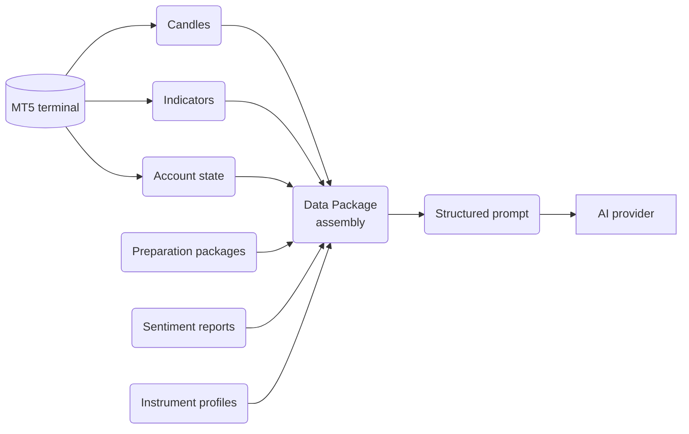

This page is the practical guide to designing data packages. By the end you'll know which decisions matter most, which combinations produce noise, and how to keep the payload disciplined enough for the AI to reason cleanly.

## What this is

The goal of a good data package is not to include everything. The goal is to include the right information for the strategy.

A data package is the assembly point for everything the AI sees in one cycle. It bundles live MT5 candles, indicator values, account state, and selected support layers into one structured prompt:

*The Data Package is the assembly point for everything the AI sees in one cycle: live MT5 data plus reusable context layers, packaged into one structured prompt.*

## How it fits into Cortiq

A data package is referenced by sessions. The same package can be used by many sessions; one session uses exactly one package. Indicators are configured on the package and applied across the timeframes where they're enabled.

For the conceptual overview, see [Playbooks & data packages](../playbooks-and-data/). This page focuses on designing them well.

## How to use it

### Pick timeframes with a job in mind

Each timeframe should have a specific role. A common professional pattern:

- One higher timeframe for structure.
- One main timeframe for setup validation.
- One tighter timeframe for entry confirmation.

If you can't explain why a timeframe is in the package, it probably doesn't belong there. Three well-chosen timeframes beat six that compete with each other.

### Pick candle depth deliberately

More history is not always better. Use deeper history when the strategy needs broader structure (swing setups, regime classification). Use shallower history when the strategy needs speed and clarity (intraday breakouts).

The question to ask: *how much history does the AI actually need to make this strategy work well?*

### Pick indicators to support — not compete with — the playbook

Indicators should support the playbook, not duplicate or contradict it. Use them when:

- The strategy genuinely depends on them.
- The AI benefits from the values consistently.
- They reduce ambiguity rather than add noise.

Don't add indicators because they're popular. Two indicators that disagree usually produce worse decisions than one indicator that's load-bearing.

### Use screenshots where the image earns its place

Screenshots are configured per timeframe. Choose which timeframes capture chart images, and the indicators on that timeframe become part of the visual context.

Screenshots are most useful when:

- The setup depends on visual pattern recognition.
- Higher-timeframe chart structure matters strongly.
- You want the AI to confirm what a human would normally inspect visually.

Use them sparingly when:

- The strategy is already clear from candles and indicators alone.
- Multiple chart images would duplicate the same information.
- Prompt size matters more than visual confirmation.

Professional setups enable screenshots only on the timeframes where the image carries weight the candles don't.

## Reference

### Data package design parts

| Part | Main job |
| --- | --- |
| Timeframes | Decide which market views the AI receives. |
| Candle depth | Decide how much history is sent per timeframe. |
| Indicators | Add technical context where it matters. |
| Screenshots | Add visual chart context where it helps. |
| News and account context | Add broader operating information. |
| Token budget | Keep the payload within a sensible size. |

### Tiers and per-timeframe scope

The data-package model supports different collection depth and screenshot scope for lighter and heavier passes. The practical takeaway:

- Not every timeframe needs the same amount of history every time.
- Not every timeframe needs screenshots every time.
- The package can be designed so the most important visual context is attached where it matters most.

### Production-ready checklist

Before treating a data package as ready:

1. Does each timeframe have a clear job?
2. Does each indicator serve the strategy rather than decorate it?
3. Are screenshots enabled only where visual context really helps?
4. Is the package still understandable when reviewed later in journals and session output?
5. Could I remove anything without hurting the strategy?

## What to read next

1. [Playbook design guide](playbook-design/) — disciplined playbook authoring, the natural pair to a tight data package.
2. [Data packages](entities/data-packages/) — the entity reference for the data package object.
3. [Supporting context](supporting-context/) — preparation, instrument profiles, sentiment.

## Related

- [Playbooks & data packages](../playbooks-and-data/)
- [Trading cycle: overview](overview/)
- [MetaTrader 5 integration](../mt5-integration/)
- [Glossary](../glossary/)
