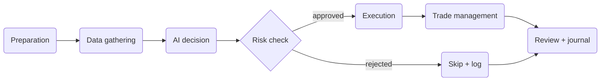

This page explains the architecture of one Cortiq cycle. By the end you'll know which pieces feed each phase and why the session — not the AI — is the right object to think outward from.

## What this is

The easiest way to understand Cortiq is to think in terms of one session running one repeatable trading cycle. That cycle is not just an AI prompt — it's a controlled operating loop assembled from a session, one or more playbooks, one data package, optional support layers, the live MT5 state, and the trade history.

Each cycle moves through six phases. Understanding the phases makes it obvious which Cortiq object you should change to influence which behavior: a problem in the entry quality is rarely a "the AI is bad" problem; it's almost always an issue in the data package or playbook *feeding* that AI.

## How it fits into Cortiq

*The trading cycle has six phases. Preparation and review bookend the cycle; the AI decision is one phase among many, not the whole loop.*

The session sits in the middle of every phase: it decides which account, symbol, provider, playbook, and data package are active, and when the session is allowed to run.

## How to use it

### Read the cycle from the session outward

Start by understanding what the session controls, then drill into each phase as needed.

| Phase | Driven by | Read more |
| --- | --- | --- |
| Preparation | Preparation packages, instrument profiles, sentiment reports | [Supporting context](supporting-context/) |
| Data gathering | Data package, MT5 bridge | [Data package design](data-package-design/) |
| AI decision | Playbook, AI provider | [Playbook design](playbook-design/) |
| Risk check | Risk validators (global + per-account) | [Risk management](../risk-management/) |
| Execution | MT5 integration | [MetaTrader 5 integration](../mt5-integration/) |
| Trade management | Playbook management rules | [Session trades and timeline](entities/session-trades-and-timeline/) |
| Review | Journal, analytics, conversations | [Journal & analytics](../journal-and-analytics/) |

### Add support layers when they earn their place

Playbooks and data packages cover the core. Support layers — session instructions, preparation packages, instrument profiles, sentiment reports — let you add structure the AI shouldn't have to rediscover every cycle.

Add a layer when its absence would noticeably hurt cycle quality. Don't add layers reflexively; a noisy preparation package is just as bad as a noisy data package.

## Reference

### How the pieces fit together

| Layer | Role | Typical question it answers |
| --- | --- | --- |
| Session | Operating container | What is this workflow allowed to do? |
| Playbooks | Strategy rules | What setups are valid? |
| Data package | Live market payload | What does the AI see every cycle? |
| Trade ideas | Specific theses | What discretionary opportunities are tracked right now? |
| Preparation package | Cached analysis | What slower-moving structure should already be known? |
| Instrument profile | Long-lived behavior | How does this instrument typically behave? |
| Sentiment report | News and macro | What external pressure matters right now? |
| Session trades and timeline | Execution record | What happened and why? |

### Where most quality problems come from

| Symptom | Most likely cause |
| --- | --- |
| AI improvises too much | Playbook is too vague. |
| AI is paralyzed by noise | Data package has too many timeframes or indicators. |
| Decisions feel disconnected from market context | Missing support layer (preparation, instrument profile, sentiment). |
| Same trade keeps recurring incorrectly | Invalidation logic in the playbook is missing or weak. |

## What to read next

1. [Session architecture](session-architecture/) — what the session itself controls and configures.
2. [Supporting context](supporting-context/) — preparation, instrument profile, sentiment.
3. [Playbook design guide](playbook-design/) — disciplined section-by-section playbook authoring.
4. [Data package design guide](data-package-design/) — payload tiers, timeframes, screenshots.

## Related

- [Sessions](entities/sessions/)
- [Sessions & AutoScan](../sessions-and-autoscan/)
- [Risk management](../risk-management/)
- [Glossary](../glossary/)
