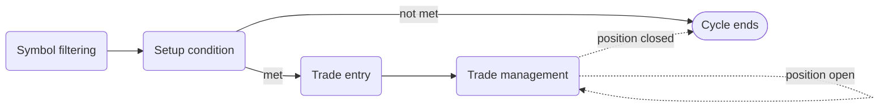

This page is the practical guide to writing playbooks the AI can follow and you can review later. By the end you'll know what each section is for, what cleanly separated sections look like, and the failure modes that produce vague or contradictory playbooks.

## What this is

A playbook is a structured document, not a paragraph. The main idea is simple: each section has one job. When sections are mixed, the AI gets a blurred strategy. When sections are clean, the AI gets a disciplined operating framework you can audit.

The same playbook structure also represents a four-step execution pipeline at runtime:

*A playbook is a four-step pipeline. Each step can short-circuit the cycle if its conditions aren't met.*

## How it fits into Cortiq

A playbook is referenced by sessions. The same playbook can run on multiple sessions; a single session can stack multiple playbooks at different priorities. The playbook itself doesn't care about the symbol or account — those come from the session.

For the conceptual overview, see [Playbooks & data packages](../playbooks-and-data/). This page focuses on writing them well.

## How to use it

### Write each section for one job

The cleanest playbooks follow this flow: describe the context, describe the trigger, describe the risk box, describe the management plan, describe the invalidation path. Five distinct jobs, five distinct sections.

#### Name and description

Make the playbook understandable to a human reviewer first. Good naming makes later journal review noticeably faster.

#### Market bias

Classify the strategy style: trend following, mean reversion, breakout, range, news-driven. This isn't where you explain the strategy — it's where you tell the AI what reasoning frame to apply.

#### Primary timeframe

Where the broader structural read happens. Trend, structure, regime — judged on this chart.

#### Entry timeframe

Where the actual trigger appears. Tighter than the primary timeframe in almost every case.

#### Setup conditions

The section for *market context*. Use it for directional alignment, structure location, trend quality, volatility conditions, higher-timeframe agreement.

Good setup conditions answer: *what must be true before we even care about an entry?*

#### Entry conditions

The section for *timing*. Use it for trigger candles, retests, confirmation behavior, level reactions, final filters.

Good entry conditions answer: *what must happen before the AI is allowed to act?*

#### Risk rules

How the trade is protected: stop-loss logic, take-profit logic, minimum reward-to-risk, no-trade conditions tied to risk.

Good risk rules tell the AI how to avoid low-quality trade framing, not only where to place the stop.

#### Trade-management rules

What happens after entry: trailing rules, break-even rules, partial exits, hold-or-reduce conditions. Keep this separate from risk rules so the AI distinguishes pre-entry discipline from post-entry management.

#### Invalidation conditions

When the whole idea should be abandoned. One of the most valuable sections in a professional playbook — it gives the AI permission to stop forcing a setup that's no longer valid.

#### Preferred symbols and sessions

Express fit. These support the main logic; they don't replace it.

## Reference

### Section purposes at a glance

| Section | Main job |
| --- | --- |
| Name and description | Identify the strategy clearly. |
| Market bias | Tell the AI what style of setup this is. |
| Primary timeframe | Define where broader structure is judged. |
| Entry timeframe | Define where the trigger must appear. |
| Setup conditions | Describe what the market must look like. |
| Entry conditions | Describe what must happen before execution. |
| Risk rules | Define stop, target, and risk boundaries. |
| Trade-management rules | Define what to do after entry. |
| Invalidation conditions | Define when the setup is no longer valid. |
| Preferred symbols and sessions | Express where the playbook fits best. |

### Common mistakes

- Putting entry logic into setup conditions.
- Mixing risk rules with management rules.
- Writing invalidation as an afterthought, or not at all.
- Writing vague playbooks that sound intelligent but can't be reviewed objectively.
- Making one playbook responsible for too many different market types.

## What to read next

1. [Data package design guide](data-package-design/) — disciplined payload design, the natural pair to a tight playbook.
2. [Playbooks](entities/playbooks/) — the entity reference for the playbook object.
3. [Trading cycle: overview](overview/) — where the playbook sits inside the broader cycle.

## Related

- [Playbooks & data packages](../playbooks-and-data/)
- [Sessions & AutoScan](../sessions-and-autoscan/)
- [Capability reference](../capability-reference/)
- [Glossary](../glossary/)
